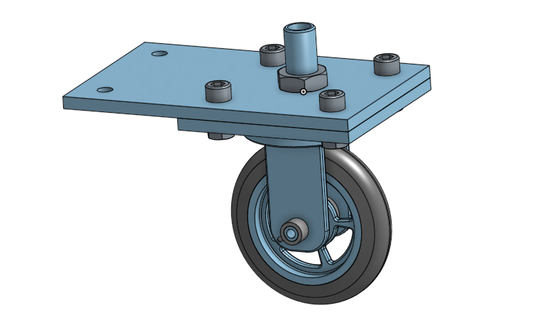

# Basic_Onshape_CAD
## Base 
I am trying to figure out my settings in Onshape along with the keyboard shortcuts in order to use Onshape as effectively as I can. I didn't use many keyboard shortcuts for this part, but I can see how they will be helpful for future assignments once I get the hang of them.

 

Link: https://cvilleschools.onshape.com/documents/fc73d56bf86be0d03ac5a29e/w/9b13dc147c3e2935cb947582/e/56fcb1f6e603d31bfa795f6a 

## Mount
I am still getting a hold of the keyboard shortcuts, but I am feeling more comfortable with pressing "r" for a quick rectangle and "c" for circle.

 

Link: https://cvilleschools.onshape.com/documents/fc73d56bf86be0d03ac5a29e/w/9b13dc147c3e2935cb947582/e/284ed37702444dfc60ad0617

## Fork
The fillets and chamfers were easy enough, and, as before, I am trying to be able to quickly perform the keyboard shortcuts.

 

Link: https://cvilleschools.onshape.com/documents/fc73d56bf86be0d03ac5a29e/w/9b13dc147c3e2935cb947582/e/e9fb61ccf222c2cab3a08c6c

## Tire
I made the tire without any trouble, but I did have to spend a little extra time looking for some of the features just because I am working on a half-screen. But that is not a significant issue, and the rotation went smoothly.

Link: https://cvilleschools.onshape.com/documents/fc73d56bf86be0d03ac5a29e/w/9b13dc147c3e2935cb947582/e/330d500270e1401085ef153e

## Wheel
The first time I tried making the wheel, some of the lines in my first sketch were not fully defined when they were supposed to be. I looked for what I did wrong and found out I made one of my dimensions incorrectly. After that, I was able to make the wheel without any trouble.

Link: https://cvilleschools.onshape.com/documents/fc73d56bf86be0d03ac5a29e/w/9b13dc147c3e2935cb947582/e/0f6859577cd430208c918b3d

## Axle, Collar, and Bearings
All of the parts were easy enough to make - the fact that a new part can be made directly on an old one makes the process easier and quicker, which is nice.

Links: 
https://cvilleschools.onshape.com/documents/fc73d56bf86be0d03ac5a29e/w/9b13dc147c3e2935cb947582/e/4165735182e61e8fd9e771eb

https://cvilleschools.onshape.com/documents/fc73d56bf86be0d03ac5a29e/w/9b13dc147c3e2935cb947582/e/0f6859577cd430208c918b3d

https://cvilleschools.onshape.com/documents/fc73d56bf86be0d03ac5a29e/w/9b13dc147c3e2935cb947582/e/766bd33d45ffb7f95d8c250b

## Sub-Assembly
A couple of times, I was not sure if I selected the correct mate connectors because it highlights the entire part when a connector is selected, but it worked out and I had no trouble creating the sub-assembly.

Link: https://cvilleschools.onshape.com/documents/fc73d56bf86be0d03ac5a29e/w/9b13dc147c3e2935cb947582/e/2f36d90183ce73c379c34946

## Final Assembly
My fork was not wide enough to fit my axle, bearing, and collar, so I had to measure the distance of the the parts and then adjust the width of the fork. I also had a little bit of trouble with the parrallel mates, but I figured everything out and my assembly looks good.

Link: https://cvilleschools.onshape.com/documents/fc73d56bf86be0d03ac5a29e/w/9b13dc147c3e2935cb947582/e/0561f24c5c415cda408e8fe5

## Onshape Challenge
The creation of the parts went smoothly (except that I incorrectly dimensioned a circle, but it was an easy fix). I had some trouble with the mates in the assembly, but once I figured out how to use a revolute and cylindrical mate, I correclty assembled the part.
